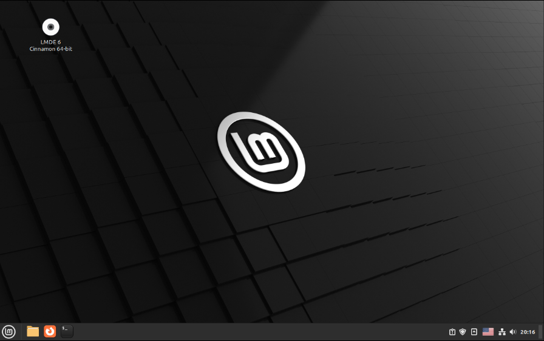
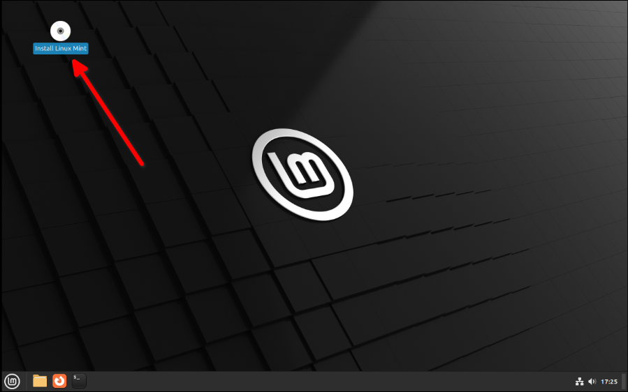
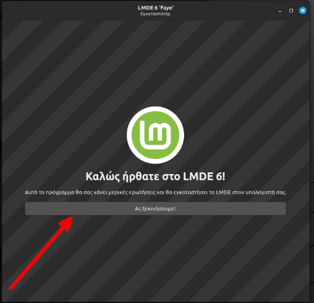
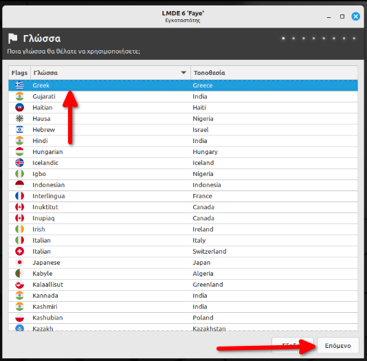
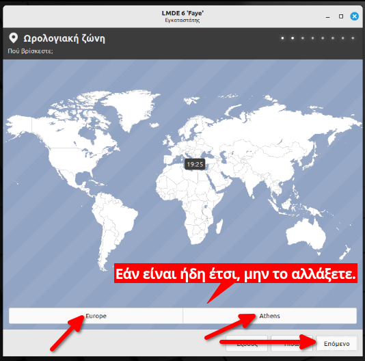
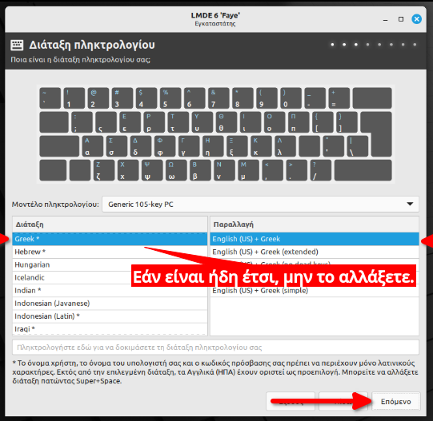
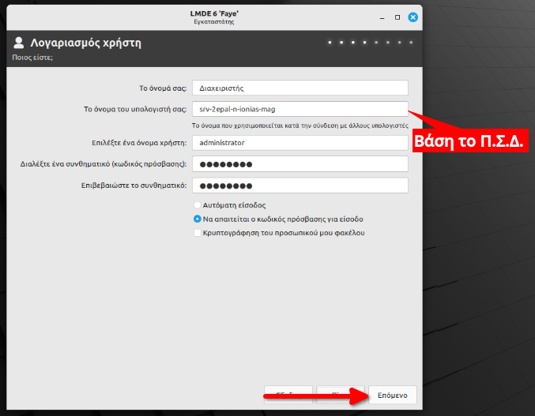
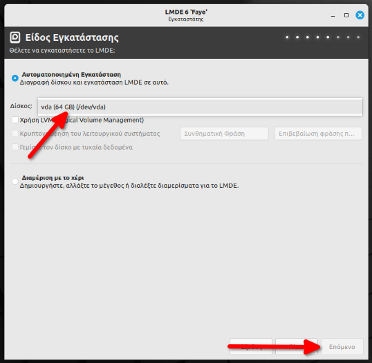
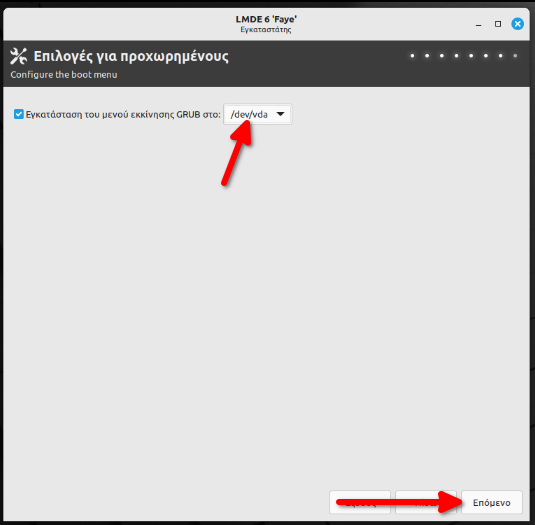
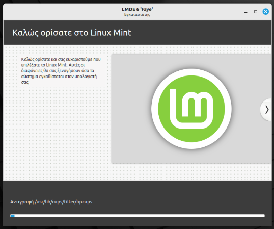

# Εγκατάσταση LMDE 6

Έχετε ήδη ακολουθήσει τα βήματα [λήψης του Ubuntu](download.md) και δημιουργίας [CD ή live USB stick](liveusb.md); Αν ναι, τοποθετήστε το USB στον υπολογιστή και εκκινήστε από αυτό. Ίσως χρειαστεί να πατήσετε πλήκτρα όπως ***Del***, ***F12***, ***Del***, ***F2***, ***ESC*** ή ***Enter*** για να εμφανίσετε τον boot manager του BIOS/UEFI.

!!! tip "Συμβουλή"

    - Το USB stick μπορεί να εμφανιστεί δύο φορές στον boot manager. Δείτε τον οδηγό [Εκκίνηση σε κατάσταση BIOS ή UEFI](../guides/bios-uefi-boot/index.md) για περισσότερες λεπτομέρειες.

    - Εάν έχετε άλλο λειτουργικό, όπως Windows, βεβαιωθείτε ότι εκκινείτε το LMDE 6 στην ίδια κατάσταση (BIOS ή UEFI) με το υπάρχον λειτουργικό. Ακολουθήστε τον οδηγό
      [Ubuntu με UEFI Windows](../guides/install-with-uefi-windows/index.md) αν χρειαστεί.

## Εισαγωγή στην Επιφάνεια Εργασίας

### Κυρίως Περιβάλλον 

Στο περιβάλλον δοκιμής μπορείτε να εκτελέσετε όποια προγράμματα θέλετε, να περιηγηθείτε στο διαδίκτυο και να εξετάσετε ότι όλα λειτουργούν κανονικά, για παράδειγμα ήχος, αναγνώριση δίσκων, δίκτυο κλπ. Εάν χρειάζεται να αλλάξετε το μέγεθος των κατατμήσεων του δίσκου σας πριν την εγκατάσταση, δείτε την ενότητα για την εφαρμογή
- ([GParted](../guides/gparted/index.md)).

### Ξεκινώντας την Εγκατάσταση 

1. Στο περιβάλλον του LMDE 6, κάντε διπλό κλικ στο εικονίδιο Εγκατάσταση LMDE 6 ***Install Linux Mint*** στην επιφάνεια εργασίας.

2. Ύστερα πατήστε ***Ας ξεκινήσουμε!***. 

### Επιλογή Γλώσσας 
Στην οθόνη του προγράμματος εγκατάστασης:

- Επιλέξτε ***Ελληνικά*** από τη λίστα γλωσσών.
- Κάντε κλικ στο ***Επόμενο***.

!!! warning clear "Προειδοποίηση" Η επιλογή της σωστής γλώσσας από την αρχή είναι σημαντική, καθώς επηρεάζει τις ρυθμίσεις του συστήματος. Ακόμα και αν προτιμάτε το αγγλικό περιβάλλον εργασίας, προτείνεται να επιλέξετε Ελληνικά και να αλλάξετε τη γλώσσα μετά την εγκατάσταση.

### Τοποθεσία 

- Επιλέξτε ***Athens*** ως τοποθεσία.
- Κάντε κλικ στο ***Επόμενο***.

### Διάταξη Πληκτρολογίου 
Επιλέξτε τις διατάξεις πληκτρολογίου:

- ***Greek*** ώς **Διάταξη** και ***English (US) + Greek*** ώς **Παραλλαγή**
- Κάντε κλίκ στο ***Επόμενο***.

### Ρυθμίσεις Χρήστη Διαχειριστή 

1. Συμπληρώστε τα πεδία:
- Όνομα: ***Διαχειριστής***, εάν η διάταξη δεν μπορεί να αλαγθεί στα Ελληνικά, κάντε το Αντιγραφή-Επικόλληση.

- Όνομα Υπολογιστή: Συμπληρώστε το όνομα με βάση το Π.Σ.Δ. (π.χ. ***srv-12lyk-ioann***).

- Όνομα Χρήστη: ***administrator***.

- Κωδικός Πρόσβασης: Επιλέξτε έναν ισχυρό κωδικό.

2. Επιλέξτε αν θέλετε Αυτόματη Είσοδος ή όχι.
3. Κάντε κλικ στο ***Επόμενο***.

!!! tip "Συμβουλή" 
  - Χρησιμοποιήστε έναν ισχυρό κωδικό πρόσβασης για την ασφάλεια του συστήματος. 
  - Το όνομα χρήστη administrator είναι σημαντικό για τη διαχείριση των κοινόχρηστων φακέλων.

### Είδος Εγκατάστασης 

1. Επιλέξτε τη σωστή κατάτμηση για εγκατάσταση. Αν έχετε δεδομένα που δεν πρέπει να διαγραφούν, δώστε προσοχή στις επιλογές.

2. Σε περιπτώσεις πολλαπλών λειτουργικών, ακολουθήστε τις οδηγίες για προστασία δεδομένων.

3. Κάντε κλικ στο ***Επόμενο*** και επιβεβαιώστε τις επιλογές σας στις επόμενες οθόνες. 

!!! danger "Προσοχή" Ο δίσκος θα μορφοποιηθεί, και τα δεδομένα θα διαγραφούν! Ελέγξτε προσεκτικά τις επιλογές σας πριν προχωρήσετε.

### Εγκατάσταση Bootloader (GRUB) 

1. Επιλέξτε την τοποθεσία εγκατάστασης του GRUB (συνήθως ο κύριος δίσκος).

2. Κάντε κλικ στο ***Επόμενο***. 

!!! tip "Συμβουλή"
  Συνήθως δεν χρειάζεται να ακουμπίσετε την προεπιλεγμένη επιλογή.

### Περίληψη Επιλογών 

1. Ελέγξτε την περίληψη των επιλογών σας για τυχόν λάθη.

2. Όταν είστε βέβαιοι, κάντε κλικ στο ***Εγκατάσταση***. 

### Αντιγραφή Αρχείων 

Η εγκατάσταση θα ξεκινήσει και μπορεί να διαρκέσει αρκετά λεπτά, ανάλογα με την ταχύτητα του συστήματος. Περιμένετε να ολοκληρωθεί η διαδικασία. 

### Ολοκλήρωση και Επανεκκίνηση 

1. Όταν η εγκατάσταση ολοκληρωθεί, κάντε κλικ στο Ναι για επανεκκίνηση.

2. Αφαιρέστε το USB stick όταν σας ζητηθεί και πατήστε Enter. 

## Διάταξη πληκτρολογίου 

- ***Ελληνικό***.
- ***Ελληνικό***.
- Κλικ στο ***Συνέχεια***.

## Ενημερώσεις και άλλο λογισμικό

- Εάν πρόκειται για προσωπικό υπολογιστή, μπορείτε να επιλέξετε την
  ***Εγκατάσταση λογισμικού τρίτων για κάρτες γραφικών και Wi-Fi, καθώς και
  πρόσθετη υποστήριξη αναπαραγωγής πολυμέσων***. Σε εξυπηρετητές LTSP μην το
  επιλέγετε, είναι καλύτερο να χρησιμοποιηθεί π.χ. ο οδηγός nouveau παρά ο
  nvidia.
- Κλικ στο ***Συνέχεια***.

## Είδος εγκατάστασης

Από
αυτόν τον διάλογο ορίζονται οι κατατμήσεις όπου θα εγκατασταθεί το Ubuntu. Εάν
τυχόν έχετε ήδη κάποιο λειτουργικό στον υπολογιστή σας, προσέξτε να μην
διαγράψετε υπάρχουσες κατατμήσεις. Μπορείτε να μειώσετε το μέγεθος μίας
υπάρχουσας κατάτμησης (π.χ. το NTFS partition των MS-Windows) ώστε να προκύψει
ελεύθερος χώρος για τη δημιουργία της κατάτμησης του Ubuntu.

Επιλέξτε το είδος της εγκατάστασης ανάλογα με τις ανάγκες σας και στη
συνέχεια επιστρέψτε στην παρούσα σελίδα:

- [Δεν υπάρχει εγκατεστημένο λειτουργικό](disk-empty.md).
- [Προϋπάρχει λειτουργικό Microsoft Windows](disk-windows.md).
- [Προϋπάρχει λειτουργικό Linux](disk-linux.md).

## Πού βρίσκεστε; 

- Επιλέξτε ***Athens***.
- Κλικ στο ***Συνέχεια***.

## Πώς λέγεστε;

- Το ονοματεπώνυμό σας: ***Διαχειριστής***. Εάν για κάποιον λόγο δεν μπορείτε
  να πληκτρολογήσετε Ελληνικά σε αυτό το σημείο, κάν' τε το
  αντιγραφή/επικόλληση.
- Το όνομα του υπολογιστή σας: ***srv-12lyk-ioann***. Το όνομα κάθε σχολικού
  server είναι μοναδικό στο Π.Σ.Δ. και προκύπτει αν από το web site του
  σχολείου (π.χ. <https://12lyk-ioann.ioa.sch.gr>) κρατήσουμε το αρχικό κομμάτι
  (π.χ. 12lyk-ioann) και προσθέσουμε "srv-" μπροστά του.
- Διαλέξτε ένα όνομα χρήστη: ***administrator***. Προτείνεται να μην αλλάξετε
  όνομα χρήστη, επειδή αυτός είναι ο ιδιοκτήτης των κοινόχρηστων φακέλων.
- Διαλέξτε ένα συνθηματικό (κωδικός πρόσβασης): ***<βάλτε password>***
- Επιβεβαιώστε το συνθηματικό: ***<επανάληψη>***
- Εάν θέλετε ο administrator να συνδέεται κατευθείαν με το που ανοίγει ο
  υπολογιστής, επιλέξτε ***Αυτόματη είσοδος***. Αυτό μπορείτε να το ρυθμίσετε
  και αργότερα.
- Κλικ στο κουμπί ***Συνέχεια***.

## Αντιγραφή αρχείων 

Ανάλογα με την ταχύτητα της σύνδεσής σας στο Internet, η λήψη και η αντιγραφή
αρχείων μπορεί να διαρκέσουν γύρω στα 15 λεπτά.

## Η εγκατάσταση ολοκληρώθηκε 

- Κλικ στο ***Επανεκκίνηση τώρα***.
